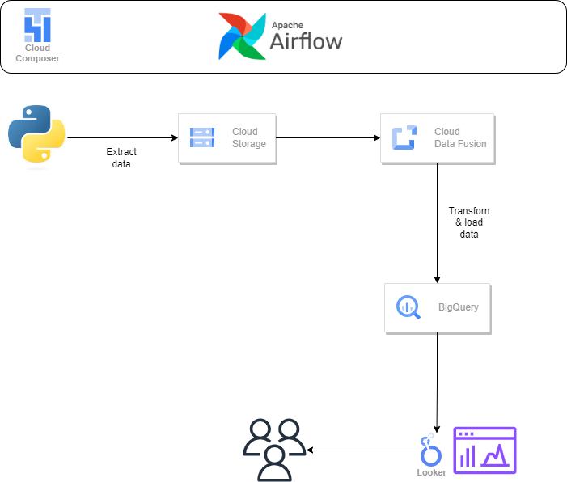

# ETL with Cloud Data Fusion, Airflow, and BigQuery

A batch ETL pipeline on Google Cloud. Employee data is generated and staged in
Cloud Storage, masked and encoded in Cloud Data Fusion so sensitive fields never
land in the clear, then loaded into BigQuery. Airflow on Cloud Composer
orchestrates the run.

[](https://cloud.google.com/)
[](https://airflow.apache.org/)
[](https://cloud.google.com/data-fusion)
[](https://cloud.google.com/bigquery)
[](LICENSE)



## What it does

| Stage | Service | Detail |
|-------|---------|--------|
| Extract | Python + Faker | Synthesises employee records, writes CSV, uploads to Cloud Storage |
| Transform | Cloud Data Fusion | Masks and encodes sensitive columns in a visual pipeline |
| Load | BigQuery | Writes the cleaned records to a BigQuery table |
| Orchestrate | Airflow on Composer | Runs extract, then triggers the Data Fusion pipeline |

The reason Data Fusion does the masking rather than the extract script is that
masking belongs in the pipeline, not in the producer. The raw file in Cloud
Storage stays the record of what arrived, and the transformation that makes it
safe is versioned and auditable on its own.

## The DAG

`dag.py` defines `employee_data`, scheduled `@daily` with `catchup=False`:

```
extract_data (BashOperator)
      |
      v
start_pipeline (CloudDataFusionStartPipelineOperator)
```

## Deploy

1. Create a Cloud Data Fusion instance and build the masking pipeline
2. Upload `extract.py` to `gs://<composer-bucket>/dags/scripts/`
3. Upload `dag.py` to `gs://<composer-bucket>/dags/`
4. Set `pipeline_name` and `location` in the DAG to match your instance
5. Point `email` in `default_args` at your own address

## Data

All employee data is synthetic, generated with Faker. The password field exists
purely to give the masking step something to act on.

## Related

[`First_GCP_Project`](https://github.com/rk-chavali/First_GCP_Project) is the
original first pass at this same pipeline, kept for reference. This repo is the
canonical version.

## License

MIT, see [LICENSE](LICENSE).
